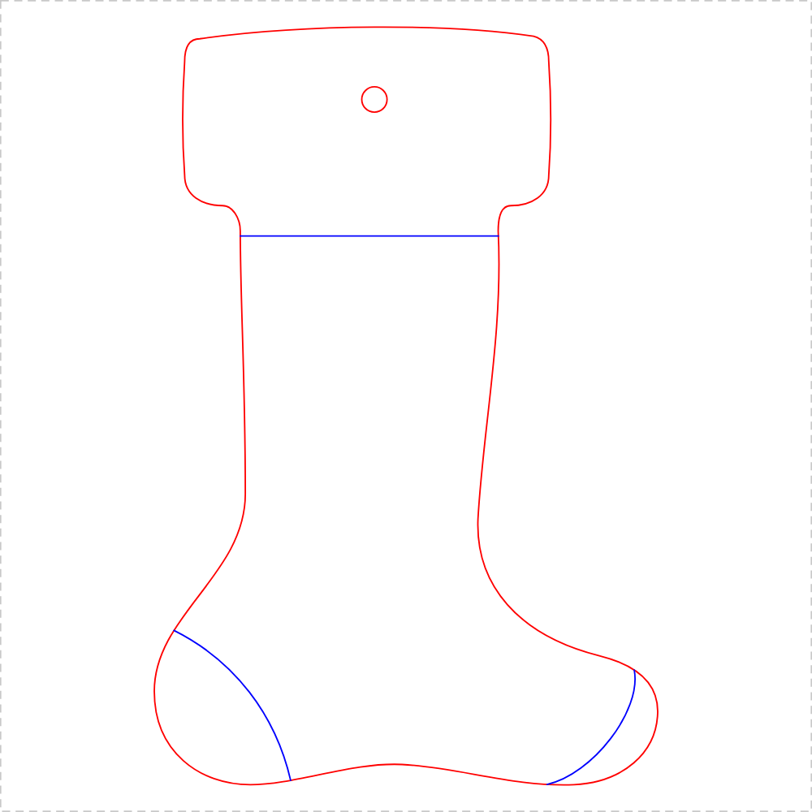
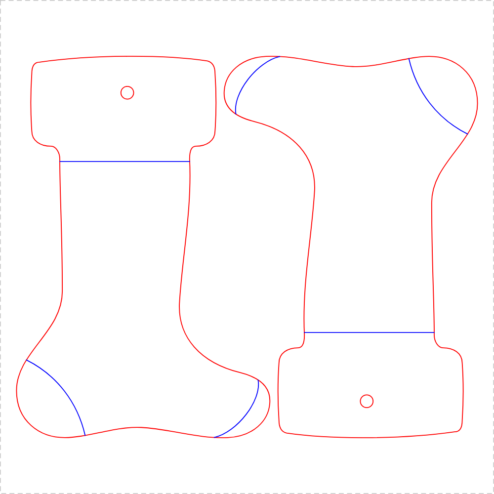
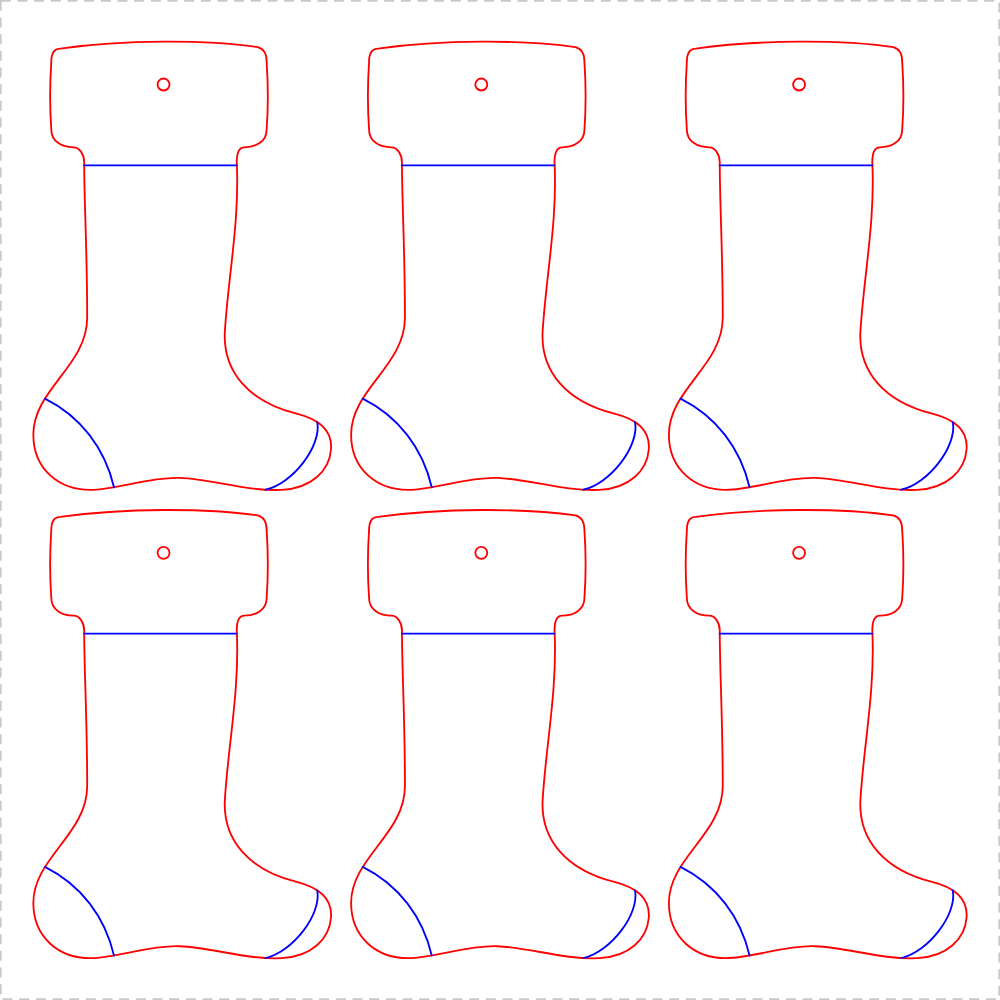

# Christmas stocking template — Glowforge Aura, 300 × 300 mm plywood

Laser-cut stocking outlines sized for a single 300 × 300 mm (30 × 30 cm) sheet
of plywood. Cut them as **wooden tracing templates** for making fabric
stockings, or as **finished wooden stockings** for the kids to paint and hang.

All three files are 300 × 300 mm artboards in real millimetres, so they drop
onto the sheet at the right size with no scaling.

| File | What you get | Size of one stocking |
|---|---|---|
| [`svg/stocking-large.svg`](svg/stocking-large.svg) | 1 stocking, as big as the sheet allows | **186 × 280 mm** |
| [`svg/stocking-pair.svg`](svg/stocking-pair.svg) | 2 stockings nested head-to-toe | **154 × 232 mm** |
| [`svg/stocking-ornaments.svg`](svg/stocking-ornaments.svg) | 6 smaller stockings | **89 × 134 mm** |

<p align="center">
  
  
  
</p>

The silhouette is the classic one: a **wide cuff band** notched in at both
sides, a leg narrower than the cuff, and a foot reaching well forward into a
big rounded toe over a gently **arched sole**.

Every stocking has a **10 mm ribbon hole** in the cuff (8 mm on the ornaments)
and three **score** lines — the cuff band, a heel patch and a toe patch — which
close off the areas kids paint. The ribbon hole is placed over the shape's
centre of mass rather than the middle of the cuff, so the piece hangs upright
instead of tipping toe-down.

## Line colours

The laser does different things to different colours. Set these two steps in
the Glowforge app after importing:

| Colour | Hex | Set the step to |
|---|---|---|
| Red | `#FF0000` | **Cut** |
| Blue | `#0000FF` | **Score** (or **Ignore** for a plain outline) |

Set blue to *Ignore* if you only want the silhouette — for a tracing template
you may prefer no marks at all.

## Cutting it

1. **Upload.** Glowforge app → *Create* → *Upload* → pick the SVG.
2. **Check the scale before you print.** Select the stocking and read the
   size Glowforge reports. It must match the table above — the large one is
   **186.0 × 280.0 mm**. If it comes in at some other size, the importer has
   rescaled it; type the correct dimensions in and re-centre on the material.
3. **Set the steps.** Red → Cut, blue → Score or Ignore.
4. **Test first.** Run a small test cut on a scrap corner of the same sheet
   before committing the whole thing.
5. **Print**, then let the sheet cool before lifting the parts out.

### Material

The Aura is a diode laser, so **3 mm (1/8") plywood or Draftboard is the sweet
spot**. 6 mm (1/4") plywood is past what it will cut cleanly, so avoid it here.

- On Proofgrade material, let the app pick the settings automatically.
- On anything else, Glowforge treats it as unknown material and you set speed
  and power yourself. Start slow, expect to need more than one pass on 3 mm
  ply, and dial it in on scrap — plywood varies a lot between sheets, so
  there is no single number worth quoting.
- Run the stocking's long axis **along the grain**. The ankle is the narrowest
  part of the piece and cross-grain ply snaps there easily.

### Fit on the Aura

The Aura takes material up to 12 × 12" (305 × 305 mm) and prints within about
292 × 292 mm of it. These files keep everything inside a **10 mm margin**, so
the whole design sits comfortably in the printable area of a 300 mm sheet.
The nested layouts are checked to hold a **5 mm gap** between neighbouring cut
lines.

Laser kerf is roughly 0.2 mm, so each cut piece comes out about 0.1 mm smaller
per side than drawn. That is far below anything that matters for a stocking.

## Using the cut pieces

**As a tracing template.** The wooden outline is the *finished* stocking shape.
Draw round it onto felt or fabric and then add a seam allowance — about 10 mm
all the way round — before you cut the fabric. You need two mirrored halves per
stocking; just flip the wooden template over for the second one.

**As a wooden stocking.** Sand the edges and wipe the soot off with a damp
cloth before handing them to children — laser-cut plywood leaves char that
transfers onto hands and clothes. Then paint, and thread ribbon through the
hole to hang.

## Changing the design

The SVGs are generated, not hand-drawn. Edit `generate_stockings.py` and rerun
it — plain Python 3, no packages needed:

```sh
python3 generate_stockings.py     # rewrites svg/
python3 render_previews.py        # rewrites preview/ (needs rsvg-convert,
                                  # inkscape or chromium)
```

Useful knobs near the top of `generate_stockings.py`:

- `OUTLINE` — the stocking shape itself, as one named list of Bézier segments.
  Everything else is a scaled copy of it, so the shape only has to be right once.
- `SHEET`, `MARGIN`, `CLEARANCE` — sheet size, edge margin and the gap held
  between parts.
- `HANG_HOLE_DIA`, `HANG_HOLE_Y` — ribbon hole size and how far down the cuff
  it sits; its x position is computed from the centroid. Drop it entirely by
  passing `hang_hole=False`.
- `CUFF_Y`, `HEEL_SCORE`, `TOE_SCORE` — the decorative score lines.

`generate_stockings.py` prints a measured report each run, so layout changes
are checked rather than eyeballed:

```
stocking-pair.svg   2 up  153.9 x 231.6 mm  part gap 5.0 mm  sheet edge 10.0 mm  hole bridge 18.3 mm
```

- **part gap** — closest approach between two cut outlines
- **sheet edge** — closest approach between any cut line and the sheet edge
- **hole bridge** — thinnest wood between a ribbon hole and the outside edge
